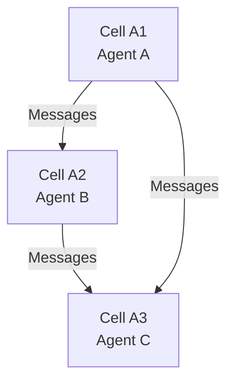

# Claw FAQ

**Frequently Asked Questions about Claw cellular agent engine**

[](https://opensource.org/licenses/MIT)
[](docs/)
[](https://www.rust-lang.org/)

**Repository:** https://github.com/SuperInstance/claw
**Last Updated:** 2026-03-18
**Version:** 0.1.0

---

## Table of Contents

1. [General Questions](#general-questions)
2. [Architecture & Design](#architecture--design)
3. [Installation & Setup](#installation--setup)
4. [Development](#development)
5. [Performance](#performance)
6. [Integration](#integration)
7. [Troubleshooting](#troubleshooting)
8. [Licensing & Legal](#licensing--legal)

---

## General Questions

### What is Claw?

**Claw** is a minimal cellular agent engine built in Rust that enables spreadsheet cells to host intelligent, autonomous agents. Each cell becomes an independent actor that can monitor data changes, reason about patterns, learn from experience, and coordinate with other agents.

### What problems does Claw solve?

Claw addresses several limitations of traditional spreadsheet automation:

- **Static formulas:** Formulas can't learn or adapt
- **Complex macros:** Difficult to maintain and error-prone
- **Disconnected scripts:** External tools lack spreadsheet integration
- **Limited intelligence:** No ML capabilities or pattern recognition

Claw enables intelligent cellular agents that can monitor, reason, learn, and coordinate autonomously.

### How is Claw different from other agent frameworks?

| Feature | Claw | LangChain | AutoGen | OpenCLAW |
|---------|------|-----------|---------|----------|
| **Language** | Rust | Python | Python | Python |
| **Cell-based** | ✅ Yes | ❌ No | ❌ No | ❌ No |
| **Spreadsheet integration** | ✅ Native | ❌ No | ❌ No | ❌ No |
| **Performance** | 10x faster | Baseline | Baseline | Baseline |
| **Type safety** | ✅ Compile-time | ❌ Runtime | ❌ Runtime | ❌ Runtime |
| **Equipment system** | ✅ Modular | ❌ No | ❌ No | ❌ No |
| **Actor model** | ✅ Yes | ❌ No | ❌ No | ❌ No |

### Is Claw production-ready?

**Current status:** Research Release

Claw has a working Rust implementation (~15,000 lines) with 163 passing tests and documented architecture. However, it's not yet production-ready:

✅ **Ready:**
- Core engine implementation
- Agent lifecycle management
- Equipment system
- Trigger handling
- Social coordination

⚠️ **In Progress:**
- Spreadsheet integration
- Performance optimization
- Security hardening
- Documentation expansion

❌ **Not Ready:**
- Production deployment
- SLA guarantees
- 24/7 support
- Enterprise features

### What are the use cases for Claw?

**Primary Use Cases:**
- **Data monitoring:** Real-time anomaly detection in spreadsheet data
- **Automated analysis:** Pattern recognition and trend analysis
- **Workflow automation:** Trigger actions based on cell changes
- **Multi-agent coordination:** Complex decision-making across cells
- **Learning systems:** Agents that improve with experience

**Example Applications:**
- Financial spreadsheet monitoring
- Inventory management optimization
- Scientific data analysis
- Business process automation
- Research data processing

---

## Architecture & Design

### What is the Cell-First Actor Model?

The **Cell-First Actor Model** is Claw's core architecture pattern where:

1. **Each cell = One agent:** Every spreadsheet cell can host an independent agent
2. **Actor isolation:** Agents have isolated state and execution contexts
3. **Message passing:** Agents communicate via asynchronous messages
4. **No shared state:** Prevents race conditions and enables scalability



### What is the Equipment System?

The **Equipment System** provides modular capabilities to agents:

```rust
// Equip agent with specific capabilities
let equipment = vec![
    EquipmentSlot::Memory,     // State persistence
    EquipmentSlot::Reasoning,   // ML inference
    EquipmentSlot::Consensus,   // Multi-agent agreement
    EquipmentSlot::Spreadsheet, // Cell integration
];
```

**Benefits:**
- **Modular:** Add/remove capabilities dynamically
- **Swappable:** Change equipment without restarting agent
- **Composable:** Combine equipment for custom behaviors
- **Efficient:** Only equip what you need

### What are Seeds?

**Seeds** are machine-learnable behavior definitions:

```rust
let seed = Seed {
    purpose: "Monitor temperature sensors".to_string(),
    trigger: TriggerConfig {
        source: "sensor_data".to_string(),
        condition: "value > 100".to_string(),
    },
    learning_strategy: LearningStrategy::Reinforcement,
};
```

**Process:**
1. **Define seed:** Natural language description of behavior
2. **Train:** Optimize on historical data
3. **Distill:** Compress to specialized model
4. **Deploy:** Use as cellular agent

### How do agents coordinate?

Claw supports multiple **coordination strategies**:

- **Parallel:** Execute simultaneously, aggregate results
- **Sequential:** Execute in order
- **Consensus:** All agents must agree
- **Majority vote:** Majority wins
- **Weighted:** Weight by confidence

```rust
let social = SocialConfig {
    agents: vec!["agent1".to_string(), "agent2".to_string()],
    coordination: CoordinationStrategy::Consensus,
    max_rounds: 10,
};
```

---

## Installation & Setup

### How do I install Claw?

**Prerequisites:**
- Rust 1.85 or later
- Git

**Installation:**
```bash
# Clone repository
git clone https://github.com/SuperInstance/claw.git
cd claw

# Build
cargo build --release

# Run tests
cargo test --all

# Run example
cargo run --example basic_agent
```

### What are the system requirements?

**Minimum:**
- CPU: 2 cores
- RAM: 4GB
- Disk: 500MB

**Recommended:**
- CPU: 4+ cores
- RAM: 8GB+
- Disk: 1GB+

**Operating Systems:**
- Linux (Ubuntu 20.04+, CentOS 8+)
- macOS (11+)
- Windows (10+ with WSL2)

### How do I integrate Claw with my spreadsheet?

Claw provides multiple integration options:

**1. WebSocket API:**
```javascript
// Connect to Claw WebSocket
const ws = new WebSocket('ws://localhost:8080/ws');

ws.onmessage = (event) => {
    const update = JSON.parse(event.data);
    // Update spreadsheet cell
    sheet.getCell(update.cell_id).value = update.value;
};
```

**2. REST API:**
```javascript
// Create agent
fetch('http://localhost:8080/api/v1/agents', {
    method: 'POST',
    headers: {
        'Content-Type': 'application/json',
        'Authorization': 'Bearer YOUR_API_KEY'
    },
    body: JSON.stringify({
        id: 'my-agent',
        cell_ref: 'A1',
        model: 'gpt-4'
    })
});
```

**3. Native Integration:**
- **spreadsheet-moment** repository provides native Claw integration
- Cells can host agents directly
- Real-time communication without external APIs

---

## Development

### How do I create a custom agent?

```rust
use claw_core::{ClawCore, AgentConfig, EquipmentSlot};

#[tokio::main]
async fn main() -> Result<(), Box<dyn std::error::Error>> {
    let mut core = ClawCore::new();

    let config = AgentConfig {
        id: "my-agent".to_string(),
        model: "gpt-4".to_string(),
        equipment: vec![
            EquipmentSlot::Memory,
            EquipmentSlot::Reasoning,
        ],
        triggers: vec!["data_change".to_string()],
        ..Default::default()
    };

    core.add_agent(config).await?;
    core.start().await?;

    Ok(())
}
```

### How do I create custom equipment?

```rust
use claw_core::equipment::{Equipment, EquipmentContext, Error};

pub struct MyCustomEquipment;

impl Equipment for MyCustomEquipment {
    fn name(&self) -> &str {
        "my_custom_equipment"
    }

    async fn execute(
        &self,
        input: &str,
        ctx: &EquipmentContext
    ) -> Result<String, Error> {
        // Your custom logic here
        Ok(format!("Processed: {}", input))
    }

    fn cleanup(&self) -> Result<(), Error> {
        // Cleanup resources
        Ok(())
    }
}
```

### How do I write tests?

```rust
#[cfg(test)]
mod tests {
    use super::*;

    #[tokio::test]
    async fn test_agent_creation() {
        let config = AgentConfig {
            id: "test-agent".to_string(),
            ..Default::default()
        };

        let agent = Agent::new(config);
        assert_eq!(agent.id(), "test-agent");
    }

    #[tokio::test]
    async fn test_trigger_processing() {
        let mut agent = Agent::new(test_config());
        let trigger = Trigger::test_data();

        let response = agent.process(trigger).await.unwrap();
        assert!(response.is_success());
    }
}
```

### How do I debug issues?

**Enable debug logging:**
```bash
RUST_LOG=debug cargo run
```

**Use debugger:**
```bash
# GDB (Linux)
rust-gdb ./target/debug/claw

# LLDB (macOS)
lldb ./target/debug/claw
```

**Enable backtrace:**
```bash
RUST_BACKTRACE=1 cargo run
```

---

## Performance

### How fast is Claw?

**Benchmarks (Ryzen 9 5900X):**

| Operation | Time | Notes |
|-----------|------|-------|
| Agent creation | ~50μs | Memory allocation |
| Trigger processing | ~1ms | Simple trigger |
| ML inference | ~100ms | GPT-4 API call |
| Message passing | ~100μs | In-memory |
| Equipment swap | ~1ms | Hot-swappable |

### How many agents can I run?

**Theoretical limits:**
- **Agents per instance:** 10,000+
- **Messages per second:** 100,000+
- **Concurrent triggers:** 1,000+

**Practical limits:**
- **Memory:** ~2MB per agent
- **CPU:** ~1% per active agent
- **Network:** Depends on ML API

### How do I optimize performance?

**1. Use async properly:**
```rust
// Good - concurrent operations
let (result1, result2) = tokio::join!(
    operation1(),
    operation2()
);

// Bad - sequential operations
let result1 = operation1().await;
let result2 = operation2().await;
```

**2. Enable caching:**
```rust
let config = CacheConfig {
    enabled: true,
    ttl_secs: 300,
    max_size: 1000,
};
```

**3. Batch operations:**
```rust
// Process multiple triggers at once
process_triggers_batch(triggers).await?;
```

**4. Use release builds:**
```bash
cargo run --release
```

---

## Integration

### Can Claw work with Excel?

**Not directly yet**, but planned:

**Current options:**
1. **WebSocket bridge:** Run Claw server, connect from Excel VBA
2. **REST API:** Call Claw APIs from Excel scripts
3. **spreadsheet-moment:** Use Univer-based spreadsheet with native Claw support

### Can Claw work with Google Sheets?

**Yes**, via API integration:

```javascript
// Google Sheets Apps Script
function onEdit(e) {
    const cell = e.range;
    const value = cell.getValue();

    // Send to Claw
    UrlFetchApp.fetch('http://localhost:8080/api/v1/triggers', {
        method: 'POST',
        payload: JSON.stringify({
            cell_id: cell.getA1Notation(),
            value: value
        })
    });
}
```

### What ML models does Claw support?

**Supported models:**
- OpenAI (GPT-3.5, GPT-4, GPT-4-turbo)
- Anthropic (Claude)
- Google (Gemini)
- Mistral
- Local models (via Ollama)

**Adding custom models:**
```rust
use claw_core::llm::{ModelProvider, ModelConfig};

let custom_model = ModelConfig {
    provider: ModelProvider::Custom,
    api_url: "https://your-api.com/v1".to_string(),
    model_name: "your-model".to_string(),
};
```

### How do I deploy Claw to production?

**Deployment options:**

**1. Docker:**
```dockerfile
FROM rust:1.85 as builder
WORKDIR /app
COPY . .
RUN cargo build --release

FROM debian:bookworm-slim
COPY --from=builder /app/target/release/claw /usr/local/bin/
EXPOSE 8080
CMD ["claw"]
```

**2. Kubernetes:**
```yaml
apiVersion: apps/v1
kind: Deployment
metadata:
  name: claw
spec:
  replicas: 3
  selector:
    matchLabels:
      app: claw
  template:
    metadata:
      labels:
        app: claw
    spec:
      containers:
      - name: claw
        image: claw:latest
        ports:
        - containerPort: 8080
```

**3. Systemd:**
```ini
[Unit]
Description=Claw Agent Engine
After=network.target

[Service]
Type=simple
User=claw
ExecStart=/usr/local/bin/claw
Restart=always

[Install]
WantedBy=multi-user.target
```

---

## Troubleshooting

### Why is my agent not responding?

**Common causes:**
1. **Agent not started:** Check agent status
2. **Trigger not configured:** Verify trigger setup
3. **Network issues:** Check API connectivity
4. **Timeout exceeded:** Increase timeout

**Diagnosis:**
```bash
# Check agent status
curl -H "Authorization: Bearer $API_KEY" \
  http://localhost:8080/api/v1/agents/$AGENT_ID

# Check logs
tail -f /var/log/claw/agent.log
```

### Why is memory usage high?

**Common causes:**
1. **Memory leak:** Unequipped equipment not cleaned up
2. **Large state:** Agent state growing unbounded
3. **Cache overflow:** Cache not expiring old entries

**Solutions:**
```rust
// Enable memory limits
let config = AgentConfig {
    max_memory_mb: 512,
    ..Default::default()
};

// Clear cache regularly
cache.clear_expired();
```

### Why are tests failing?

**Common issues:**
1. **Timing issues:** Async operations not awaited
2. **Missing mocks:** External dependencies not mocked
3. **Resource cleanup:** Resources not cleaned up between tests

**Solutions:**
```rust
// Add delays for async
tokio::time::sleep(Duration::from_millis(100)).await;

// Use test fixtures
let fixture = TestFixture::new();

// Cleanup in tests
impl Drop for TestFixture {
    fn drop(&mut self) {
        self.cleanup();
    }
}
```

---

## Licensing & Legal

### What license does Claw use?

Claw is released under the **MIT License**:

```
MIT License

Copyright (c) 2026 SuperInstance

Permission is hereby granted, free of charge, to any person obtaining a copy
of this software and associated documentation files (the "Software"), to deal
in the Software without restriction...
```

**Summary:**
- ✅ Free to use
- ✅ Free to modify
- ✅ Free to distribute
- ✅ Commercial use allowed
- ⚠️ No warranty
- ⚠️ No liability

### Can I use Claw in commercial projects?

**Yes!** The MIT license allows commercial use without restrictions.

### What about third-party dependencies?

Claw uses several third-party libraries, each with their own licenses:

- **Tokio:** MIT
- **Serde:** MIT/Apache-2.0
- **Reqwest:** MIT/Apache-2.0
- **Sqlx:** MIT/Apache-2.0

All dependencies are permissive and compatible with commercial use.

### How do I cite Claw in academic papers?

```bibtex
@software{claw2026,
  author = {SuperInstance Team},
  title = {Claw: A Minimal Cellular Agent Engine for Spreadsheets},
  year = {2026},
  url = {https://github.com/SuperInstance/claw},
  version = {0.1.0}
}
```

---

## Getting Help

### Where can I find documentation?

- **README:** [README.md](README.md)
- **Architecture:** [docs/ARCHITECTURE.md](docs/ARCHITECTURE.md)
- **API Reference:** [docs/API_REFERENCE.md](docs/API_REFERENCE.md)
- **Troubleshooting:** [TROUBLESHOOTING_GUIDE.md](TROUBLESHOOTING_GUIDE.md)

### How do I report bugs?

1. **Search existing issues:** https://github.com/SuperInstance/claw/issues
2. **Create new issue:** https://github.com/SuperInstance/claw/issues/new
3. **Include:**
   - Rust version (`rustc --version`)
   - Operating system
   - Error messages
   - Minimal reproduction case

### How do I request features?

1. **Check roadmap:** [ROADMAP.md](ROADMAP.md)
2. **Search discussions:** https://github.com/SuperInstance/claw/discussions
3. **Create feature request:** https://github.com/SuperInstance/claw/issues/new
4. **Provide:**
   - Use case description
   - Proposed solution
   - Alternative approaches

### How do I contribute?

See [CONTRIBUTION_GUIDE.md](CONTRIBUTION_GUIDE.md) for detailed guidelines:

**Quick start:**
```bash
# Fork repository
git clone https://github.com/YOUR_USERNAME/claw.git
cd claw

# Create feature branch
git checkout -b feature/your-feature

# Make changes and test
cargo test --all

# Submit pull request
git push origin feature/your-feature
```

---

## Community

### Where can I chat with other users?

- **Discord:** https://discord.gg/claw
- **Matrix:** #claw:matrix.org
- **Reddit:** r/claw

### How do I stay updated?

- **Watch repository:** Click "Watch" on GitHub
- **Follow releases:** https://github.com/SuperInstance/claw/releases
- **Read blog:** https://blog.claw.example.com
- **Subscribe to newsletter:** https://claw.example.com/newsletter

---

**Last Updated:** 2026-03-18
**Version:** 0.1.0
**Contributors:** See [CONTRIBUTORS.md](CONTRIBUTORS.md)

---

**Still have questions?**

- **Email:** support@claw.example.com
- **Twitter:** @claw_agents
- **GitHub Issues:** https://github.com/SuperInstance/claw/issues
