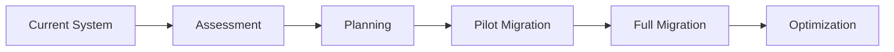

# Claw Migration Guide

**Guide for migrating from other agent systems to Claw**

[](https://opensource.org/licenses/MIT)
[](docs/)
[](https://www.rust-lang.org/)

**Repository:** https://github.com/SuperInstance/claw
**Last Updated:** 2026-03-18
**Version:** 0.1.0

---

## Table of Contents

1. [Overview](#overview)
2. [Migrating from OpenCLAW](#migrating-from-openclaw)
3. [Migrating from LangChain](#migrating-from-langchain)
4. [Migrating from AutoGen](#migrating-from-autogen)
5. [Migrating from Custom Systems](#migrating-from-custom-systems)
6. [Data Migration](#data-migration)
7. [API Migration](#api-migration)
8. [Testing Migration](#testing-migration)
9. [Rollback Strategy](#rollback-strategy)

---

## Overview

### Why Migrate to Claw?

**Key Benefits:**
- **Cell-First Design:** Each cell is an independent agent
- **Rust Performance:** 10x faster than Python-based systems
- **Type Safety:** Compile-time guarantees prevent runtime errors
- **Actor Model:** Scalable message-driven architecture
- **Equipment System:** Modular, swappable capabilities
- **Spreadsheet Integration:** Native cell-based deployment

### Migration Path



### Migration Checklist

- [ ] Assess current system architecture
- [ ] Identify agent types and behaviors
- [ ] Map equipment to existing modules
- [ ] Design migration strategy
- [ ] Set up pilot migration
- [ ] Test pilot migration
- [ ] Plan full migration
- [ ] Execute full migration
- [ ] Monitor and optimize

---

## Migrating from OpenCLAW

### Architecture Comparison

**OpenCLAW:**
```python
# OpenCLAW Python-style
agent = OpenClawAgent(
    name="temperature-monitor",
    loop=True,
    interval=5
)

@agent.trigger("sensor_reading")
def process_reading(data):
    if data.value > 100:
        return "HIGH"
    return "LOW"
```

**Claw:**
```rust
// Claw Rust-style
use claw_core::{ClawCore, AgentConfig, EquipmentSlot};

#[tokio::main]
async fn main() -> Result<(), Box<dyn std::error::Error>> {
    let mut core = ClawCore::new();

    let config = AgentConfig {
        id: "temperature-monitor".to_string(),
        model: "deepseek-chat".to_string(),
        equipment: vec![
            EquipmentSlot::Memory,
            EquipmentSlot::Reasoning,
        ],
        triggers: vec!["sensor_reading".to_string()],
        ..Default::default()
    };

    core.add_agent(config).await?;
    core.start().await?;

    Ok(())
}
```

### Concept Mapping

| OpenCLAW Concept | Claw Equivalent | Notes |
|-----------------|-----------------|-------|
| `OpenClawAgent` | `ClawAgent` | Core agent type |
| `@agent.trigger` | `TriggerConfig` | Declarative triggers |
| `agent.loop` | Tokio runtime | Async event loop |
| `agent.interval` | `debounce_ms` | Trigger timing |
| `agent.memory` | `EquipmentSlot::Memory` | Explicit equipment |
| `agent.reasoning` | `EquipmentSlot::Reasoning` | ML capabilities |

### Migration Steps

1. **Convert agent definitions:**
```python
# OpenCLAW
class TemperatureAgent(OpenClawAgent):
    def __init__(self):
        super().__init__(name="temp-agent")
        self.memory = []
        self.threshold = 100
```

```rust
// Claw
use claw_core::{AgentConfig, EquipmentSlot};

let config = AgentConfig {
    id: "temp-agent".to_string(),
    equipment: vec![
        EquipmentSlot::Memory,
    ],
    config: maplit::map! {
        "threshold".to_string() => "100".to_string()
    },
    ..Default::default()
};
```

2. **Convert triggers:**
```python
# OpenCLAW
@agent.trigger("sensor_reading")
def process(data):
    return analyze(data)
```

```rust
// Claw
use claw_core::TriggerConfig;

let trigger = TriggerConfig {
    source: "sensor_reading".to_string(),
    condition: "value != null".to_string(),
    handler: "analyze".to_string(),
    debounce_ms: 1000,
};
```

3. **Convert memory access:**
```python
# OpenCLAW
agent.memory.append(data)
recent = agent.memory[-10:]
```

```rust
// Claw
use claw_core::equipment::MemoryEquipment;

let memory = agent.get_equipment::<MemoryEquipment>();
memory.store(data.clone())?;
let recent = memory.get_recent(10)?;
```

### Breaking Changes

1. **No global state:**
```python
# OpenCLAW - Global state allowed
global_state = {}

@agent.trigger
def handler(data):
    global_state['key'] = data
```

```rust
// Claw - No global state
// Each agent has isolated state
let state = agent.get_state();
state.set("key", data)?;
```

2. **Explicit error handling:**
```python
# OpenCLAW - Implicit errors
def handler(data):
    return risky_operation(data)  # May raise
```

```rust
// Claw - Explicit Result types
async fn handler(data: Data) -> Result<Response, Error> {
    risky_operation(data).await?
}
```

3. **Type safety:**
```python
# OpenCLAW - Dynamic types
def handler(data):
    return data["value"] + 10  # May fail at runtime
```

```rust
// Claw - Static types
async fn handler(data: SensorData) -> Result<i32, Error> {
    Ok(data.value + 10)  // Checked at compile time
}
```

---

## Migrating from LangChain

### Architecture Comparison

**LangChain:**
```python
from langchain.agents import AgentExecutor, create_openai_agent
from langchain.tools import Tool

tools = [
    Tool(name="calculator", func=calculator),
    Tool(name="search", func=search),
]

agent = create_openai_agent(tools, llm)
executor = AgentExecutor(agent=agent, tools=tools)
```

**Claw:**
```rust
use claw_core::{ClawCore, AgentConfig, EquipmentSlot};

let config = AgentConfig {
    id: "langchain-migration".to_string(),
    model: "gpt-4".to_string(),
    equipment: vec![
        EquipmentSlot::Reasoning,  // LLM
        EquipmentSlot::Memory,     // Context
    ],
    tools: vec![
        "calculator".to_string(),
        "search".to_string(),
    ],
    ..Default::default()
};
```

### Concept Mapping

| LangChain Concept | Claw Equivalent | Notes |
|-------------------|-----------------|-------|
| `AgentExecutor` | `ClawCore` | Core runtime |
| `Tool` | `Equipment` | Modular capabilities |
| `LLMChain` | `ReasoningEquipment` | LLM integration |
| `Memory` | `MemoryEquipment` | State management |
| `PromptTemplate` | `Seed` | Behavior definition |
| `CallbackHandler` | `Trigger` | Event handling |

### Migration Steps

1. **Convert tools to equipment:**
```python
# LangChain
def calculator(input: str) -> str:
    return str(eval(input))

tool = Tool(
    name="calculator",
    func=calculator,
    description="Performs math calculations"
)
```

```rust
// Claw
use claw_core::equipment::{Equipment, EquipmentContext};

struct CalculatorEquipment;

impl Equipment for CalculatorEquipment {
    fn name(&self) -> &str {
        "calculator"
    }

    async fn execute(&self, input: &str, _ctx: &EquipmentContext) -> Result<String, Error> {
        // Safe evaluation
        let result = meval::eval_str(input)?;
        Ok(result.to_string())
    }
}
```

2. **Convert chains to seeds:**
```python
# LangChain
from langchain.prompts import PromptTemplate

prompt = PromptTemplate(
    template="Analyze: {input}",
    input_variables=["input"]
)

chain = LLMChain(llm=llm, prompt=prompt)
```

```rust
// Claw
use claw_core::Seed;

let seed = Seed {
    purpose: "Analyze input data".to_string(),
    template: "Analyze: {input}".to_string(),
    variables: vec!["input".to_string()],
    model: "gpt-4".to_string(),
};
```

3. **Convert memory:**
```python
# LangChain
from langchain.memory import ConversationBufferMemory

memory = ConversationBufferMemory(
    memory_key="chat_history",
    return_messages=True
)
```

```rust
// Claw
use claw_core::equipment::MemoryEquipment;

let memory = MemoryEquipment::new(MemoryConfig {
    max_size: 1000,
    ttl_secs: 3600,
});
```

### Breaking Changes

1. **No dynamic tool discovery:**
```python
# LangChain - Dynamic tools
tools = load_tools_from_plugins()
```

```rust
// Claw - Static registration
let registry = EquipmentRegistry::new();
registry.register(Box::new(CalculatorEquipment));
```

2. **Explicit async:**
```python
# LangChain - Implicit async
def handler(data):
    return process(data)  # May block
```

```rust
// Claw - Explicit async
async fn handler(data: Data) -> Result<Response> {
    process(data).await
}
```

---

## Migrating from AutoGen

### Architecture Comparison

**AutoGen:**
```python
from autogen import AssistantAgent, UserProxyAgent

assistant = AssistantAgent(
    name="assistant",
    llm_config={"model": "gpt-4"}
)

user_proxy = UserProxyAgent(
    name="user",
    human_input_mode="NEVER"
)

user_proxy.initiate_chat(
    assistant,
    message="Solve this problem"
)
```

**Claw:**
```rust
use claw_core::{ClawCore, AgentConfig, SocialConfig};

let assistant = AgentConfig {
    id: "assistant".to_string(),
    model: "gpt-4".to_string(),
    equipment: vec![EquipmentSlot::Reasoning],
    social: Some(SocialConfig {
        role: "assistant".to_string(),
        coordination: CoordinationStrategy::Sequential,
    }),
    ..Default::default()
};

let user_proxy = AgentConfig {
    id: "user".to_string(),
    model: "gpt-4".to_string(),
    equipment: vec![EquipmentSlot::Reasoning],
    social: Some(SocialConfig {
        role: "user".to_string(),
        coordination: CoordinationStrategy::Sequential,
    }),
    ..Default::default()
};
```

### Concept Mapping

| AutoGen Concept | Claw Equivalent | Notes |
|-----------------|-----------------|-------|
| `AssistantAgent` | Agent with `Reasoning` | LLM-powered |
| `UserProxyAgent` | Agent with triggers | User interaction |
| `GroupChat` | `SocialConfig` | Multi-agent |
| `Conversation` | Message exchange | Communication |
| `CodeExecutor` | `ExecutionEquipment` | Code execution |

### Migration Steps

1. **Convert agent types:**
```python
# AutoGen
assistant = AssistantAgent(
    name="assistant",
    system_message="You are a helpful assistant"
)
```

```rust
// Claw
let config = AgentConfig {
    id: "assistant".to_string(),
    model: "gpt-4".to_string(),
    system_message: "You are a helpful assistant".to_string(),
    ..Default::default()
};
```

2. **Convert group chat:**
```python
# AutoGen
groupchat = autogen.GroupChat(
    agents=[agent1, agent2, agent3],
    messages=[],
    max_round=10
)

manager = autogen.GroupChatManager(
    groupchat=groupchat
)
```

```rust
// Claw
use claw_core::social::{SocialConfig, CoordinationStrategy};

let social = SocialConfig {
    agents: vec!["agent1".to_string(), "agent2".to_string()],
    coordination: CoordinationStrategy::Consensus,
    max_rounds: 10,
    ..Default::default()
};
```

3. **Convert conversations:**
```python
# AutoGen
user_proxy.initiate_chat(
    assistant,
    message="Hello",
    clear_history=True
)
```

```rust
// Claw
use claw_core::Message;

let msg = Message {
    from: "user".to_string(),
    to: "assistant".to_string(),
    content: "Hello".to_string(),
    timestamp: SystemTime::now(),
};

core.send_message(msg).await?;
```

---

## Migrating from Custom Systems

### General Approach

1. **Analyze current architecture:**
   - Identify agent types
   - Map communication patterns
   - Catalog capabilities
   - Document state management

2. **Design Claw equivalents:**
   - Create agent configs
   - Implement equipment
   - Define triggers
   - Set up social patterns

3. **Implement migration:**
   - Port agent logic
   - Migrate state
   - Test functionality
   - Optimize performance

### Example Migration

**Before (Custom Python):**
```python
class CustomAgent:
    def __init__(self, name):
        self.name = name
        self.state = {}
        self.handlers = {}

    def on(self, event):
        def decorator(func):
            self.handlers[event] = func
            return func
        return decorator

    def emit(self, event, data):
        if event in self.handlers:
            return self.handlers[event](data)

agent = CustomAgent("my-agent")

@agent.on("data")
def handle_data(data):
    agent.state["last_data"] = data
    return process(data)
```

**After (Claw):**
```rust
use claw_core::{AgentConfig, TriggerConfig, ClawCore};
use std::collections::HashMap;

#[tokio::main]
async fn main() -> Result<(), Box<dyn std::error::Error>> {
    let mut core = ClawCore::new();

    let config = AgentConfig {
        id: "my-agent".to_string(),
        model: "gpt-4".to_string(),
        triggers: vec![
            TriggerConfig {
                source: "data".to_string(),
                handler: "handle_data".to_string(),
                ..Default::default()
            }
        ],
        ..Default::default()
    };

    core.add_agent(config).await?;
    core.start().await?;

    Ok(())
}
```

---

## Data Migration

### State Migration

```python
# Export from old system
import json

state = {
    "agents": [
        {
            "id": "agent-1",
            "state": {...},
            "memory": [...]
        }
    ]
}

with open("migration.json", "w") as f:
    json.dump(state, f)
```

```rust
// Import to Claw
use claw_core::migration::Migration;

let migration = Migration::from_file("migration.json")?;
migration.migrate_to(&core).await?;
```

### Configuration Migration

```yaml
# old-config.yaml
agents:
  - name: agent-1
    model: gpt-4
    tools:
      - calculator
      - search
    memory:
      max_size: 1000
```

```rust
// Claw config
use claw_core::AgentConfig;

let configs: Vec<AgentConfig> = serde_yaml::from_str("
- id: agent-1
  model: gpt-4
  equipment:
    - Calculator
    - Search
  memory:
    max_size: 1000
")?;
```

---

## API Migration

### REST API

**Before:**
```python
# Flask
@app.route('/agents/<id>', methods=['GET'])
def get_agent(id):
    agent = agents.get(id)
    return jsonify(agent.to_dict())
```

**After:**
```rust
// Claw + Actix-web
use actix_web::{web, HttpResponse};

#[get("/agents/{id}")]
async fn get_agent(
    id: web::Path<String>,
    core: web::Data<ClawCore>
) -> Result<HttpResponse, Error> {
    let agent = core.get_agent(id.into_inner()).await?;
    Ok(HttpResponse::Ok().json(agent))
}
```

### WebSocket

**Before:**
```python
# Flask-SocketIO
@socketio.on('message')
def handle_message(data):
    emit('response', process(data))
```

**After:**
```rust
// Claw + Tokio-tungstenite
use tokio_tungstenite::tungstenite::Message;

async fn handle_message(
    message: Message,
    core: &ClawCore
) -> Result<Message, Error> {
    match message {
        Message::Text(data) => {
            let response = core.process(data).await?;
            Ok(Message::Text(response))
        }
        _ => Ok(Message::Text("Invalid".to_string()))
    }
}
```

---

## Testing Migration

### Migration Tests

```rust
#[cfg(test)]
mod migration_tests {
    use super::*;

    #[tokio::test]
    async fn test_agent_migration() {
        // Create old system agent
        let old_agent = create_old_agent();

        // Migrate to Claw
        let new_agent = migrate_agent(old_agent).await?;

        // Test functionality
        assert_eq!(new_agent.id, "migrated-agent");
        assert!(new_agent.is_running().await?);
    }

    #[tokio::test]
    async fn test_state_migration() {
        // Create old state
        let old_state = OldState {...};

        // Migrate state
        let new_state = migrate_state(old_state)?;

        // Verify state
        assert_eq!(new_state.get("key"), "value");
    }
}
```

### Performance Testing

```rust
use criterion::{black_box, criterion_group, criterion_main, Criterion};

fn benchmark_migration(c: &mut Criterion) {
    c.bench_function("migrate_agent", |b| {
        b.iter(|| {
            let old_agent = create_old_agent();
            migrate_agent(black_box(old_agent))
        })
    });
}

criterion_group!(benches, benchmark_migration);
criterion_main!(benches);
```

---

## Rollback Strategy

### Blue-Green Deployment

```bash
# Run both systems in parallel
./old-system --port 8080 &
./new-system --port 8081 &

# Use proxy to switch traffic
# Nginx config:
upstream backend {
    server localhost:8080;  # Old system
    # server localhost:8081;  # New system
}
```

### Feature Flags

```rust
use flagger::{Flag, FlagManager};

let flags = FlagManager::new();

if flags.is_enabled("use_claw") {
    // Use new Claw system
    core.process(data).await?
} else {
    // Use old system
    old_system.process(data)?
}
```

### Gradual Migration

```rust
// Migrate agents one at a time
for agent_id in agent_ids {
    let old_agent = old_system.get_agent(agent_id)?;
    let new_agent = migrate_agent(old_agent).await?;

    // Test new agent
    if test_agent(&new_agent).await? {
        // Switch to new agent
        core.add_agent(new_agent).await?;
        old_system.remove_agent(agent_id)?;
    } else {
        // Rollback
        eprintln!("Migration failed for {}", agent_id);
    }
}
```

---

## Best Practices

1. **Test thoroughly:**
   - Unit tests for each component
   - Integration tests for workflows
   - Performance tests for benchmarks

2. **Monitor closely:**
   - Log all migrations
   - Track performance metrics
   - Set up alerts for failures

3. **Plan rollback:**
   - Keep old system running
   - Document rollback steps
   - Test rollback procedure

4. **Communicate:**
   - Notify users of changes
   - Provide migration guides
   - Offer support during transition

---

**Last Updated:** 2026-03-18
**Version:** 0.1.0
**Contributors:** See [CONTRIBUTORS.md](CONTRIBUTORS.md)
