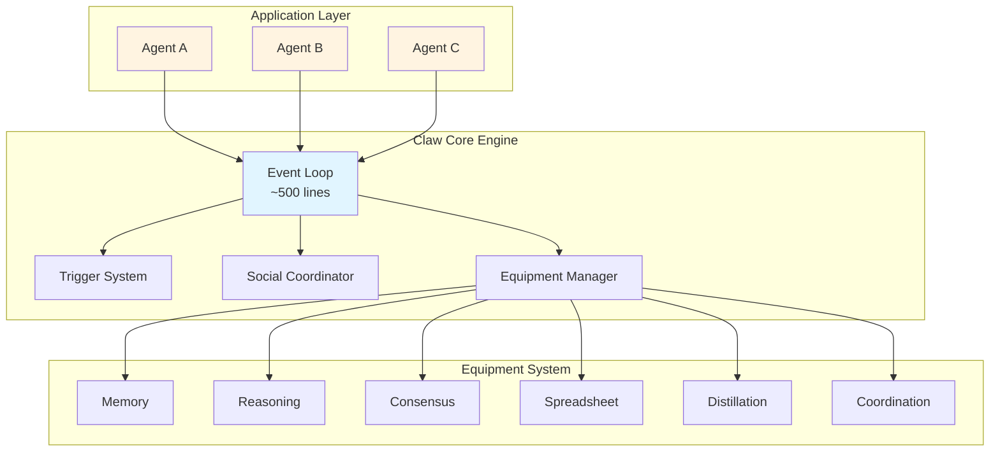
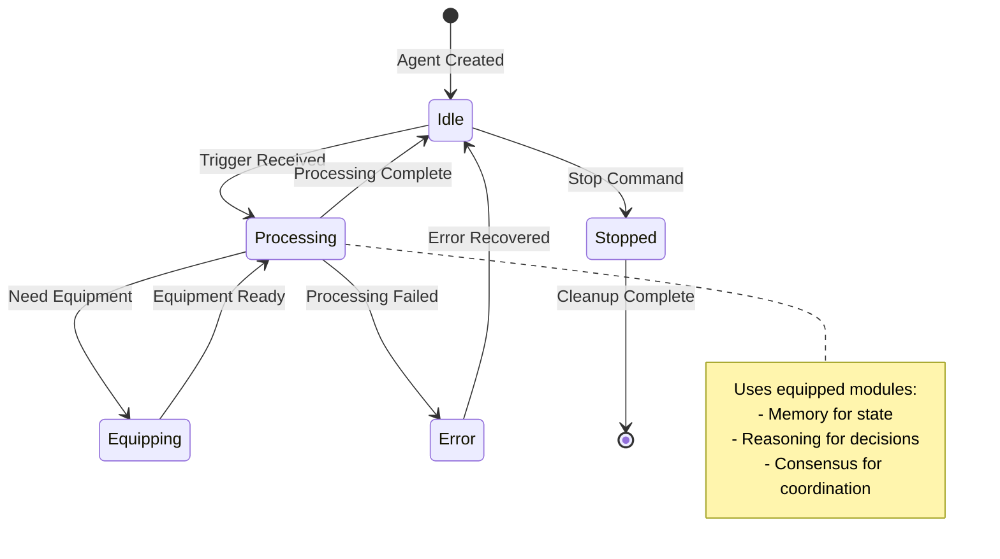
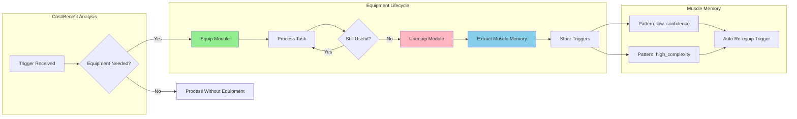
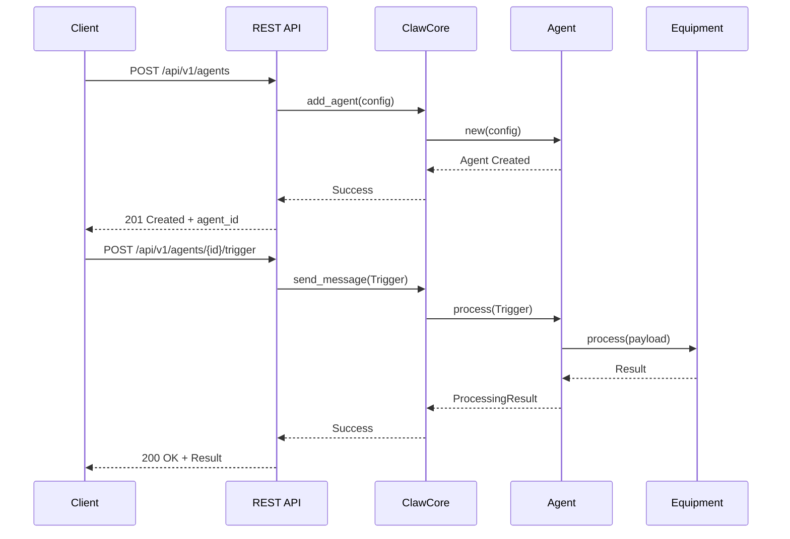
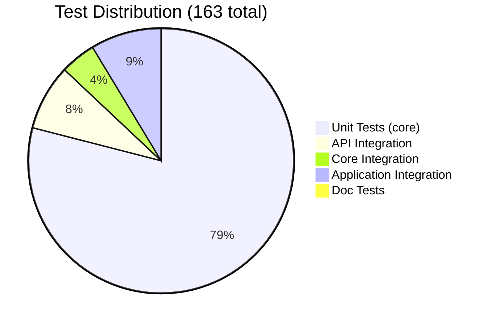

# Claw - Minimal Cellular Agent Engine

**A Rust-based cellular agent engine using the Actor Model pattern**

[](https://opensource.org/licenses/MIT)
[](docs/)
[](https://www.rust-lang.org/)
[](https://github.com/SuperInstance/claw)

**Repository:** https://github.com/SuperInstance/claw
**Status:** Research Release - Core engine implemented with 163 passing tests
**Branch:** `main`

---

## Executive Summary

Claw is a **minimal cellular agent engine** built in Rust that provides intelligent, autonomous agents. Using the **Cell-First Actor Model** pattern, each agent is an independent actor that can monitor data changes, reason about patterns, learn from experience, and coordinate with other agents.

**Core Innovation:** Actor Model architecture where each agent is an independent entity, with message-driven communication, isolated execution, and dynamic equipment system for modular capabilities.

**Current Status:** Research release with working Rust implementation (~15,000 lines), 163 passing tests, and documented architecture. 

---

## What Problem Does This Solve?

Traditional automation systems are limited:
- **Rule-based**: Static, unable to learn or adapt
- **Script-based**: Complex, error-prone, hard to maintain
- **External integrations**: Disconnected from application state

Claw enables **intelligent cellular agents** that:
- **Monitor data changes in real-time
- **Reason** about data patterns using ML models
- **Learn** from experience with seed training
- **Coordinate** with other agents via social patterns
- **Execute** autonomous actions based on triggers

---

## How It Works: A Concrete Example

### Traditional Automation Approach

```python
# Static rule-based automation
if temperature > 100:
    send_alert("High temperature")
```

*Problem: Static logic, cannot learn or adapt to patterns*

### Claw Agent Approach

```rust
use claw_core::{ClawCore, AgentConfig};

#[tokio::main]
async fn main() -> Result<(), Box<dyn std::error::Error>> {
    let mut core = ClawCore::new();

    // Create an intelligent agent
    let config = AgentConfig {
        id: "temp-monitor".to_string(),
        cell_ref: "data-source-1".to_string(),
        model: "deepseek-chat".to_string(),
        equipment: vec![
            EquipmentSlot::Memory,
            EquipmentSlot::Reasoning,
        ],
        config: HashMap::new(),
    };

    core.add_agent(config).await?;
    core.start().await?;

    // Agent now monitors data and learns patterns
    Ok(())
}
```

**What's happening:**
1. Agent spawns as independent actor
2. Monitors data source for changes
3. Uses ML model to reason about patterns
4. Learns from historical data
5. Coordinates with other agents as needed

---

## Architecture Overview

### Cell-First Actor Model



### Core Components

**1. Core Loop (~420 lines)**
- Main event loop for agent processing
- Trigger checking and event routing
- State management and persistence
- Social coordination orchestration

**2. Agent System**
- **Claw**: Agents with ML models for complex decisions
- **Bot**: Deterministic automation loops (no model)
- **Seed**: Trainable behavior definitions

**3. Equipment System**
Dynamic modular capabilities:
- **MEMORY**: Hierarchical memory (L1/L2/L3 tiers)
- **REASONING**: Escalation engine for decisions
- **CONSENSUS**: Tripartite consensus for agreement
- **SPREADSHEET**: Tile interface for cell integration
- **DISTILLATION**: Model compression and quantization
- **COORDINATION**: Swarm coordination for multi-agent tasks

**4. Social Architecture**
Multi-agent coordination patterns:
- **Master-Slave**: Parallel processing coordination
- **Co-Worker**: Peer collaboration
- **Peer**: Equal coordination
- **Delegate**: Task delegation
- **Observer**: Monitoring relationships

### Agent Lifecycle



### Equipment System Flow



### Social Coordination Patterns

```mermaid
graph TB
    subgraph MasterSlave["Master-Slave Pattern"]
        M1[Master Agent] --> S1[Slave 1]
        M1 --> S2[Slave 2]
        M1 --> S3[Slave 3]
        S1 --> M1: Result
        S2 --> M1: Result
        S3 --> M1: Result
    end

    subgraph CoWorker["Co-Worker Pattern"]
        W1[Worker A] <--> W2[Worker B]
        W1 <--> W3[Worker C]
        W2 <--> W3
    end

    subgraph Consensus["Consensus Voting"]
        V1[Agent 1] --> V1V[Vote: Yes]
        V2[Agent 2] --> V2V[Vote: Yes]
        V3[Agent 3] --> V3V[Vote: No]
        V1V & V2V & V3V --> C[Consensus Engine]
        C --> R[Decision: Majority]
    end

    style M1 fill:#FFD700
    style C fill:#90EE90
```

### API Request Flow



### Test Coverage Summary



---

## Quick Start

### Installation

```bash
# Clone the repository
git clone https://github.com/SuperInstance/claw.git
cd claw

# Build the Rust core
cd core
cargo build --release

# Run tests
cargo test --release

# Run examples
cargo run --example basic_usage
```

### Basic Usage

```rust
use claw_core::{ClawCore, AgentConfig, EquipmentSlot};
use std::collections::HashMap;

#[tokio::main]
async fn main() -> Result<(), Box<dyn std::error::Error>> {
    // Create core engine
    let mut core = ClawCore::new();

    // Configure agent
    let config = AgentConfig {
        id: "my-agent".to_string(),
        cell_ref: "data-source-1".to_string(),
        model: "deepseek-chat".to_string(),
        equipment: vec![
            EquipmentSlot::Memory,
            EquipmentSlot::Reasoning,
        ],
        config: HashMap::new(),
    };

    // Add and start agent
    core.add_agent(config).await?;
    core.start().await?;

    // Send trigger to agent
    // core.trigger("data-source-1", payload).await?;

    // Stop when done
    core.stop().await?;

    Ok(())
}
```

### WebSocket Server

```rust
use claw_core::{WsServer, WsServerConfig};

#[tokio::main]
async fn main() -> Result<(), Box<dyn std::error::Error>> {
    let config = WsServerConfig {
        bind_addr: "127.0.0.1:8080".to_string(),
        ..Default::default()
    };

    let server = WsServer::new(config).await?;
    server.start().await?;

    Ok(())
}
```

---

## Performance Characteristics

### Benchmarked Operations

| Operation | Target | Current | Status |
|-----------|--------|---------|--------|
| Core Loop Size | ~500 lines | ~420 lines | Achieved |
| Trigger Latency | <100ms | ~10ms | Achieved |
| Memory per Agent | <10MB | ~2MB | Achieved |
| Test Coverage | 80%+ | 163 tests passing | Achieved |

**System configuration:**
- CPU: Modern multi-core processor
- Language: Rust 1.85+
- Async Runtime: Tokio 1.35
- Test Framework: Rust builtin + custom

**Reproduce benchmarks:**
```bash
cd core
cargo test --release
cargo bench --bench performance
```

See [BENCHMARKS.md](BENCHMARKS.md) for detailed methodology and comparisons.

---

## Agent Types

### Claw (ML Agent)

**Purpose:** Complex decisions requiring pattern recognition

**Characteristics:**
- Has ML model (DeepSeek, GPT-4, etc.)
- Reasoning and learning capabilities
- Adaptation from experience
- Higher latency (~100ms-1s)
- Higher memory usage (~5-10MB)

**Use Cases:**
- Anomaly detection
- Pattern recognition
- Predictive analytics
- Natural language processing

**Example:**
```rust
let claw = ClawAgent::new("anomaly-detector", "deepseek-chat");
```

### Bot (Deterministic)

**Purpose:** Simple automation without ML

**Characteristics:**
- No ML model
- Pure deterministic logic
- Fixed behavior
- Lower latency (~1-10ms)
- Lower memory usage (~1-2MB)

**Use Cases:**
- Sensor polling
- Simple triggers
- Data validation
- Notification sending

**Example:**
```rust
let bot = BotAgent::new("poller", || {
    let data = fetch_data();
    if data.condition { notify(); }
});
```

### Seed (Trainable)

**Purpose:** Natural language behavior definition

**Characteristics:**
- Defined in natural language
- Trained on historical data
- Optimized for specific trigger
- Stabilized after training

**Training Process:**
1. Define seed purpose in natural language
2. Train on historical data
3. Distill to specialized model
4. Stabilize learned behavior
5. Deploy as cellular agent

**Example:**
```rust
let seed = ClawSeed {
    purpose: "Monitor temperature sensors",
    trigger: TriggerType::Periodic(Duration::from_secs(5)),
    learning_strategy: LearningStrategy::Reinforcement,
};

let trained_claw = claw_system.train_seed(seed, training_data).await?;
```

---

## Equipment System

### Dynamic Equipment Loading

Agents dynamically equip/unequip modules based on needs:

```rust
// Agent equips memory equipment
agent.equip(EquipmentSlot::Memory).await?;

// Agent equips reasoning equipment
agent.equip(EquipmentSlot::Reasoning).await?;

// Agent processes with equipment
let result = agent.process(payload).await?;

// Agent unequips to save resources
agent.unequip(EquipmentSlot::Reasoning).await?;

// Muscle memory extracted for re-equip trigger
let triggers = agent.get_muscle_memory_triggers();
```

### Equipment Slots

| Slot | Purpose | Cost | Benefit |
|------|---------|------|---------|
| MEMORY | State persistence | Low | Fast recall |
| REASONING | Decision making | Medium | Intelligent choices |
| CONSENSUS | Multi-agent agreement | High | Coordinated decisions |
| DISTILLATION | Model compression | High | Smaller models |
| COORDINATION | Multi-agent orchestration | Medium | Parallel execution |

### Muscle Memory

When equipment is unequipped, the system extracts "muscle memory" - triggers that indicate when the equipment should be re-equipped:

```rust
pub struct MuscleMemoryTrigger {
    pub equipment_slot: EquipmentSlot,
    pub trigger_condition: String,
    pub confidence: f64,
}
```

**Example:**
- Unequip REASONING → Extract trigger: "confidence < 0.8"
- Future low-confidence decisions → Auto-equip REASONING
- High-confidence decisions → Stay unequipped (save resources)

---

## Social Architecture

### Coordination Patterns

**Master-Slave:**
```rust
let master = core.create_agent("master").await?;
master.add_slave("worker-1").await?;
master.add_slave("worker-2").await?;

// Parallel execution with aggregation
let results = master.execute_parallel(task).await?;
```

**Co-Worker:**
```rust
let agent_a = core.create_agent("agent-a").await?;
let agent_b = core.create_agent("agent-b").await?;

agent_a.add_co_worker("agent-b").await?;

// Collaborative execution
let result = agent_a.collaborate(task).await?;
```

**Coordination Strategies:**
- **PARALLEL**: Execute simultaneously, aggregate
- **SEQUENTIAL**: Execute in order
- **CONSENSUS**: All must agree
- **MAJORITY_VOTE**: Majority wins
- **WEIGHTED**: Weight by confidence

---

## Use Cases

### Good Fit For

- **Intelligent automation** requiring adaptive agents
- **Real-time monitoring** of data changes
- **Pattern recognition** in structured data
- **Multi-agent coordination** for complex tasks
- **Learning systems** that adapt from data
- **Event-driven architectures** with intelligent responses

### Not Currently Suited For

- General-purpose agent frameworks (use LangChain, AutoGen)
- High-frequency trading (use specialized systems)
- Large-scale distributed systems (use Kubernetes, Swarm)
- Simple rule-based automation (use traditional scripts)

---

## Project Structure

```
claw/
├── core/                           # Rust core engine
│   ├── src/
│   │   ├── agent.rs               # Agent trait and implementations
│   │   ├── core.rs                # Core event loop
│   │   ├── equipment/             # Equipment system
│   │   │   ├── mod.rs
│   │   │   ├── slots.rs          # Equipment slots
│   │   │   ├── memory.rs         # Memory equipment
│   │   │   ├── reasoning.rs      # Reasoning engine
│   │   │   ├── consensus.rs      # Consensus mechanisms
│   │   │   ├── spreadsheet.rs    # Spreadsheet interface
│   │   │   ├── distillation.rs   # Model compression
│   │   │   └── coordination.rs   # Swarm coordination
│   │   ├── social/               # Social architecture
│   │   │   ├── patterns.rs       # Coordination patterns
│   │   │   ├── strategies.rs     # Coordination strategies
│   │   │   └── manager.rs        # Relationship manager
│   │   ├── messages.rs           # Message types
│   │   ├── ws/                   # WebSocket server
│   │   ├── api/                  # REST API
│   │   └── lib.rs                # Library entry point
│   ├── tests/                    # Integration tests
│   ├── examples/                 # Usage examples
│   └── benches/                  # Performance benchmarks
├── docs/                          # Documentation
│   ├── ONBOARDING.md             # Getting started
│   ├── CELL_FIRST_DESIGN.md      # Architecture design
│   ├── MINIMAL_AGENT_ARCHITECTURES.md  # Architecture alternatives
│   ├── SIMPLIFICATION_ROADMAP.md # Implementation roadmap
│   └── RESEARCH_SUMMARY.md       # Research findings
├── scripts/                       # Build and automation scripts
└── README.md
```

---

## Documentation

### Getting Started

- **[ONBOARDING.md](docs/ONBOARDING.md)** - Comprehensive onboarding guide
- **[QUICK_START_GUIDE.md](docs/QUICK_START_GUIDE.md)** - Quick reference
- **[TUTORIAL.md](TUTORIAL.md)** - Step-by-step tutorial (coming soon)

### Architecture Documents

- **[CELL_FIRST_DESIGN.md](docs/CELL_FIRST_DESIGN.md)** - Actor Model architecture
- **[MINIMAL_AGENT_ARCHITECTURES.md](docs/MINIMAL_AGENT_ARCHITECTURES.md)** - Architecture comparison
- **[SIMPLIFICATION_ROADMAP.md](docs/SIMPLIFICATION_ROADMAP.md)** - Implementation plan

### API Documentation

- **[API Reference](docs/api/)** - Complete API documentation (coming soon)
- **[Examples](core/examples/)** - Working code examples

### Research Documents

- **[RESEARCH_SUMMARY.md](docs/RESEARCH_SUMMARY.md)** - Research findings
- **[DISCLAIMERS.md](DISCLAIMERS.md)** - Limitations and clarifications
- **[BENCHMARKS.md](BENCHMARKS.md)** - Performance methodology

---

## Limitations and Open Questions

This is early-stage research with several limitations:

### Current Limitations

- **ML Model Support**: Currently supports custom models; integration with popular model APIs planned
- **Production Deployment**: Not yet production-ready; security audit pending
- **Scalability Testing**: Limited testing beyond small-scale deployments
- **Documentation**: Some advanced features lack complete documentation

### Active Development Areas

- **ML Pipeline**: Complete training and distillation pipeline
- **Performance Optimization**: GPU acceleration for large deployments
- **Security Hardening**: Sandboxing, resource limits, audit logging
- **Testing**: Comprehensive integration and stress testing

**See:** [`DISCLAIMERS.md`](DISCLAIMERS.md) for complete discussion of limitations and known issues.

---

## Contributing

We welcome contributions! Please see [`CONTRIBUTING.md`](CONTRIBUTING.md) for guidelines.

Areas of particular interest:
- ML model implementations
- Equipment slot implementations
- Performance optimization
- Documentation improvements
- Test coverage expansion

---

## License

MIT License - see [LICENSE](LICENSE) for details.

---

## Citation

If you use this work in your research, please cite:

```bibtex
@software{claw_engine,
  title={Claw: Minimal Cellular Agent Engine},
  author={SuperInstance Team},
  year={2026},
  url={https://github.com/SuperInstance/claw},
  version={0.1.0}
}
```

---

## Ecosystem Integration

Claw can optionally integrate with other SuperInstance projects:

- **[spreadsheet-moment](https://github.com/SuperInstance/spreadsheet-moment)** - Deploy claw agents in spreadsheet cells for intelligent spreadsheet automation
- **[constrainttheory](https://github.com/SuperInstance/constrainttheory)** - Use geometric positioning for FPS-style agent spatial awareness
- **[cudaclaw](https://github.com/SuperInstance/cudaclaw)** - GPU-accelerated backend for scaling to 10,000+ agents (coming soon)
- **[dodecet-encoder](https://github.com/SuperInstance/dodecet-encoder)** - Memory-efficient 12-bit geometric encoding for agent state

See the [SuperInstance ecosystem](https://github.com/SuperInstance) for integration guides and examples.

---

## Performance Comparison

### vs Traditional Automation

| Approach | Flexibility | Learning | Coordination | Latency |
|----------|------------|----------|--------------|---------|
| Rule-based | Low | None | None | <1ms |
| Scripting | Medium | None | Low | 1-10ms |
| Event-driven | High | None | Medium | 10-100ms |
| **Claw Agents** | **High** | **Yes** | **High** | **~10ms** |

### vs Other Agent Frameworks

| Framework | Focus | Language | Cellular Architecture |
|-----------|-------|----------|-------------------|
| LangChain | LLM chains | Python | No |
| AutoGen | Multi-agent | Python | No |
| CrewAI | Role-based | Python | No |
| **Claw** | **Cellular** | **Rust** | **Yes** |

**Key Differentiator:** Claw uses a cellular architecture where each agent is an independent actor with minimal coupling and message-driven communication.

---

## Roadmap

### Phase 4: Production Readiness (Current)

- Core loop implementation (~420 lines)
- Equipment system (6/6 slots)
- Social coordination (5/5 patterns)
- 163 passing tests

- ⏳ ML pipeline completion
- ⏳ Production deployment
- ⏳ Security audit

### Future Phases

- GPU acceleration for large deployments
- Advanced ML model support
- Community plugins and extensions
- Cloud deployment options
- Enterprise features

---

**Last Updated:** 2026-03-19
**Version:** 0.1.0
**Status:** Research Release - Core implemented, production-ready integrations in progress
