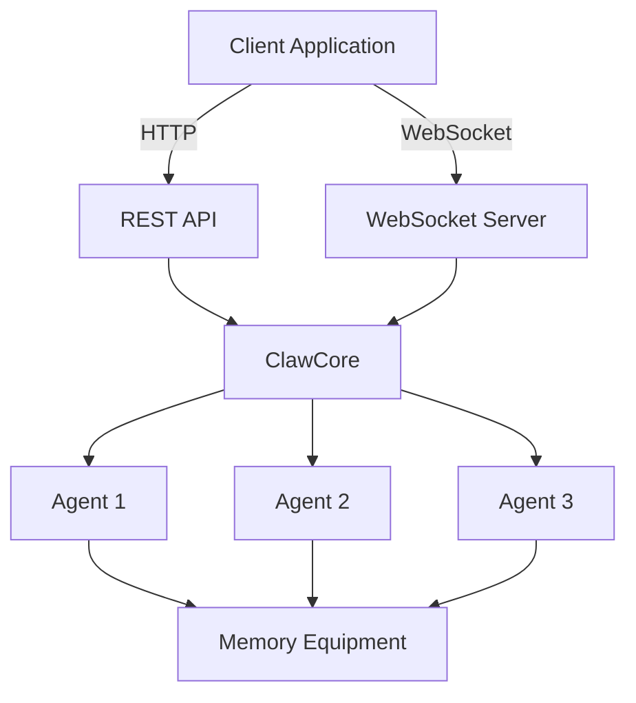

# Claw Core API Reference

**Version:** 0.1.0
**Status:** MVP (Minimal Viable Product)
**Language:** Rust

---

## Table of Contents

- [Overview](#overview)
- [Core Types](#core-types)
- [Agent API](#agent-api)
- [Equipment API](#equipment-api)
- [Messages API](#messages-api)
- [REST API](#rest-api)
- [WebSocket API](#websocket-api)
- [Error Handling](#error-handling)

---

## Overview

Claw Core is a minimal cellular agent engine built on the **Cell-First Actor Model**. It provides:

- **Agents**: Cellular agents with state and behavior
- **Memory Equipment**: Single slot for basic state persistence
- **Triggers**: Cell-based activation system
- **REST API**: Simple CRUD operations
- **WebSocket**: Real-time agent updates

### Architecture



---

## Core Types

### `AgentStatus`

Agent status enum representing the current state of an agent.

```rust
pub enum AgentStatus {
    Idle,        // Agent is idle
    Processing,  // Agent is processing
    Error(String), // Agent encountered an error
    Stopped,     // Agent is stopped
}
```

**Variants:**
- `Idle` - Agent is available for work
- `Processing` - Agent is actively processing a message
- `Error(String)` - Agent encountered an error with message
- `Stopped` - Agent has been stopped and won't process new messages

---

### `AgentConfig`

Configuration for creating a new agent.

```rust
pub struct AgentConfig {
    pub id: String,                              // Unique agent identifier
    pub cell_ref: String,                        // Spreadsheet cell reference (e.g., "A1")
    pub model: String,                           // Model name (e.g., "gpt-4")
    pub config: HashMap<String, serde_json::Value>, // Additional configuration
}
```

**Fields:**
- `id` - Unique identifier for the agent
- `cell_ref` - Spreadsheet cell reference where agent is located
- `model` - AI model to use for processing
- `config` - Additional key-value configuration options

**Example:**
```rust
use claw_core::AgentConfig;
use std::collections::HashMap;

let config = AgentConfig {
    id: "my-agent".to_string(),
    cell_ref: "A1".to_string(),
    model: "gpt-4".to_string(),
    config: {
        let mut map = HashMap::new();
        map.insert("temperature".to_string(), serde_json::json!(0.7));
        map
    },
};
```

---

### `AgentState`

Current state of an agent.

```rust
pub struct AgentState {
    pub status: AgentStatus,                     // Current status
    pub memory: HashMap<String, serde_json::Value>, // Agent memory
    pub has_memory_equipment: bool,              // Whether memory equipment is equipped
}
```

**Fields:**
- `status` - Current agent status
- `memory` - Key-value storage for agent state
- `has_memory_equipment` - Whether memory equipment is currently equipped

**Default:**
```rust
impl Default for AgentState {
    fn default() -> Self {
        Self {
            status: AgentStatus::Idle,
            memory: HashMap::new(),
            has_memory_equipment: false,
        }
    }
}
```

---

## Agent API

### `Agent` Trait

Core trait that all agents must implement.

```rust
#[async_trait]
pub trait Agent: Send + Sync {
    fn id(&self) -> &str;
    fn status(&self) -> &AgentStatus;
    fn state(&self) -> AgentState;
    async fn process(&mut self, message: Message) -> Result<ProcessingResult>;
    async fn query(&self, query_type: QueryType) -> Result<serde_json::Value>;
    async fn equip_memory(&mut self, equipment: Box<dyn Equipment>) -> Result<()>;
    async fn stop(&mut self) -> Result<()>;
}
```

#### Methods

##### `id() -> &str`

Get the agent's unique identifier.

**Returns:** Agent ID as string slice

**Example:**
```rust
let agent_id = agent.id();
assert_eq!(agent_id, "my-agent");
```

---

##### `status() -> &AgentStatus`

Get the agent's current status.

**Returns:** Reference to current `AgentStatus`

**Example:**
```rust
let status = agent.status();
assert_eq!(status, &AgentStatus::Idle);
```

---

##### `state() -> AgentState`

Get a snapshot of the agent's complete state.

**Returns:** Clone of `AgentState`

**Example:**
```rust
let state = agent.state();
println!("Agent status: {:?}", state.status);
println!("Memory items: {}", state.memory.len());
```

---

##### `process(&mut self, message: Message) -> Result<ProcessingResult>`

Process a message and return the result.

**Parameters:**
- `message` - The message to process

**Returns:** `Result<ProcessingResult>` - Processing result or error

**Errors:**
- `AgentError::UnsupportedMessage` - Message type not supported
- `AgentError::ProcessingError` - Error during processing

**Example:**
```rust
use claw_core::messages::{Message, TriggerPayload};

let message = Message::Trigger {
    payload: TriggerPayload::Data {
        cell_ref: "A1".to_string(),
        new_value: serde_json::json!(42),
        old_value: serde_json::json!(null),
    }
};

let result = agent.process(message).await?;
println!("Processing time: {}ms", result.processing_time_ms);
```

---

##### `query(&self, query_type: QueryType) -> Result<serde_json::Value>`

Query the agent for specific information.

**Parameters:**
- `query_type` - Type of query to perform

**Returns:** `Result<serde_json::Value>` - Query result or error

**Query Types:**
- `QueryType::State` - Get agent state
- `QueryType::Reasoning` - Get reasoning information (MVP: placeholder)
- `QueryType::Learning` - Get learning information (MVP: placeholder)
- `QueryType::Equipment` - Get equipment status
- `QueryType::Social` - Get social information (MVP: placeholder)

**Example:**
```rust
use claw_core::messages::QueryType;

let state = agent.query(QueryType::State).await?;
let equipment = agent.query(QueryType::Equipment).await?;

println!("State: {}", state);
println!("Memory equipped: {}", equipment["memory_equipped"]);
```

---

##### `equip_memory(&mut self, equipment: Box<dyn Equipment>) -> Result<()>`

Equip memory equipment on the agent.

**Parameters:**
- `equipment` - Box<dyn Equipment> to equip

**Returns:** `Result<()>` - Success or error

**Errors:**
- `AgentError::InvalidEquipment` - Equipment slot not supported

**Example:**
```rust
use claw_core::equipment::SimpleMemoryEquipment;

let memory = Box::new(SimpleMemoryEquipment::new());
agent.equip_memory(memory).await?;
```

---

##### `stop(&mut self) -> Result<()>`

Stop the agent.

**Returns:** `Result<()>` - Success or error

**Example:**
```rust
agent.stop().await?;
assert_eq!(agent.status(), &AgentStatus::Stopped);
```

---

### `MinimalAgent` Implementation

Default implementation of the `Agent` trait.

```rust
pub struct MinimalAgent {
    id: String,
    cell_ref: String,
    model: String,
    config: HashMap<String, serde_json::Value>,
    state: AgentState,
    memory_equipment: Option<Box<dyn Equipment>>,
}
```

#### Constructor

```rust
pub fn new(config: AgentConfig) -> Self
```

Create a new minimal agent from configuration.

**Parameters:**
- `config` - Agent configuration

**Returns:** New `MinimalAgent` instance

**Example:**
```rust
use claw_core::{MinimalAgent, AgentConfig};

let config = AgentConfig {
    id: "my-agent".to_string(),
    cell_ref: "A1".to_string(),
    model: "gpt-4".to_string(),
    config: HashMap::new(),
};

let agent = MinimalAgent::new(config);
```

#### Methods

##### `config(&self) -> &AgentConfig`

Get the agent's configuration.

##### `cell_ref(&self) -> &str`

Get the agent's cell reference.

##### `model(&self) -> &str`

Get the agent's model name.

---

## Equipment API

### `Equipment` Trait

Trait for equipment that can be equipped on agents.

```rust
#[async_trait]
pub trait Equipment: Send + Sync {
    fn slot(&self) -> EquipmentSlot;
    async fn process(&self, data: HashMap<String, serde_json::Value>) -> Result<String>;
}
```

#### Methods

##### `slot(&self) -> EquipmentSlot`

Get the equipment slot type.

**Returns:** `EquipmentSlot` enum value

---

##### `process(&self, data: HashMap<String, serde_json::Value>) -> Result<String>`

Process data through the equipment.

**Parameters:**
- `data` - Input data as key-value map

**Returns:** `Result<String>` - Processed result or error

---

### `EquipmentSlot` Enum

Available equipment slots.

```rust
pub enum EquipmentSlot {
    Memory,      // Memory equipment slot
    Reasoning,   // Reasoning equipment slot (MVP: not implemented)
    Consensus,   // Consensus equipment slot (MVP: not implemented)
}
```

---

### `SimpleMemoryEquipment` Implementation

Basic memory equipment implementation.

```rust
pub struct SimpleMemoryEquipment {
    memory: HashMap<String, serde_json::Value>,
}
```

#### Constructor

```rust
pub fn new() -> Self
```

Create a new simple memory equipment instance.

**Returns:** New `SimpleMemoryEquipment` instance

**Example:**
```rust
use claw_core::equipment::SimpleMemoryEquipment;

let memory = SimpleMemoryEquipment::new();
```

---

## Messages API

### `Message` Enum

Messages that can be sent to agents.

```rust
pub enum Message {
    Trigger {
        payload: TriggerPayload,
    },
    Cancel,
    Query {
        query_type: QueryType,
    },
}
```

#### Variants

##### `Trigger { payload }`

Trigger agent with payload.

**Fields:**
- `payload` - `TriggerPayload` enum

---

##### `Cancel`

Cancel the agent's current operation.

---

##### `Query { query_type }`

Query agent for information.

**Fields:**
- `query_type` - `QueryType` enum

---

### `TriggerPayload` Enum

Payload types for trigger messages.

```rust
pub enum TriggerPayload {
    Data {
        cell_ref: String,
        new_value: serde_json::Value,
        old_value: serde_json::Value,
    },
    Periodic {
        interval_ms: u64,
    },
    Formula {
        formula: String,
        result: serde_json::Value,
    },
    External {
        source: String,
        event_data: HashMap<String, serde_json::Value>,
    },
}
```

#### Variants

##### `Data { cell_ref, new_value, old_value }`

Data change trigger.

**Fields:**
- `cell_ref` - Cell reference that changed
- `new_value` - New cell value
- `old_value` - Previous cell value

---

##### `Periodic { interval_ms }`

Periodic time-based trigger.

**Fields:**
- `interval_ms` - Interval in milliseconds

---

##### `Formula { formula, result }`

Formula evaluation trigger.

**Fields:**
- `formula` - Formula string
- `result` - Formula result

---

##### `External { source, event_data }`

External event trigger.

**Fields:**
- `source` - Event source identifier
- `event_data` - Event data as key-value map

---

### `QueryType` Enum

Types of queries that can be performed.

```rust
pub enum QueryType {
    State,
    Reasoning,
    Learning,
    Equipment,
    Social,
}
```

---

### `ProcessingResult` Struct

Result of processing a message.

```rust
pub struct ProcessingResult {
    pub agent_id: String,
    pub message_id: String,
    pub success: bool,
    pub output: Option<String>,
    pub processing_time_ms: u64,
}
```

**Fields:**
- `agent_id` - ID of the agent that processed the message
- `message_id` - ID of the processed message
- `success` - Whether processing was successful
- `output` - Optional output string
- `processing_time_ms` - Processing time in milliseconds

---

## REST API

### Base URL

```
http://localhost:8080/api
```

### Endpoints

#### POST /api/claws

Create a new claw agent.

**Request:**
```json
{
  "id": "my-agent",
  "cell_ref": "A1",
  "model": "gpt-4",
  "config": {
    "temperature": 0.7
  }
}
```

**Response (200):**
```json
{
  "id": "my-agent",
  "status": "Idle",
  "created_at": "2024-03-18T12:00:00Z"
}
```

**Error (400):**
```json
{
  "error": "VALIDATION_ERROR",
  "message": "Invalid agent configuration"
}
```

---

#### GET /api/claws/{id}

Get agent information.

**Parameters:**
- `id` - Agent ID (path parameter)

**Response (200):**
```json
{
  "id": "my-agent",
  "status": "Idle",
  "state": {
    "status": "Idle",
    "memory": {},
    "has_memory_equipment": false
  },
  "cell_ref": "A1",
  "model": "gpt-4"
}
```

**Error (404):**
```json
{
  "error": "NOT_FOUND",
  "message": "Agent not found"
}
```

---

#### POST /api/claws/{id}/trigger

Trigger an agent.

**Parameters:**
- `id` - Agent ID (path parameter)

**Request:**
```json
{
  "payload": {
    "Data": {
      "cell_ref": "A1",
      "new_value": 42,
      "old_value": null
    }
  }
}
```

**Response (200):**
```json
{
  "agent_id": "my-agent",
  "message_id": "msg-1234567890",
  "success": true,
  "output": "Processed trigger: Data {...}",
  "processing_time_ms": 10
}
```

---

#### POST /api/claws/{id}/cancel

Cancel agent operation.

**Parameters:**
- `id` - Agent ID (path parameter)

**Response (200):**
```json
{
  "success": true,
  "message": "Agent cancelled"
}
```

---

#### DELETE /api/claws/{id}

Delete an agent.

**Parameters:**
- `id` - Agent ID (path parameter)

**Response (200):**
```json
{
  "success": true,
  "message": "Agent deleted"
}
```

---

## WebSocket API

### Connection URL

```
ws://localhost:8080/ws
```

### Authentication

Include API key as query parameter:

```
ws://localhost:8080/ws?token=your_api_key
```

### Message Format

All WebSocket messages follow this structure:

```json
{
  "type": "MESSAGE_TYPE",
  "trace_id": "trace_1234567890_abc123",
  "timestamp": 1710756000000,
  "payload": {
    // Message-specific data
  }
}
```

### Message Types

#### STATE_CHANGE

Agent state changed.

**Payload:**
```json
{
  "agent_id": "my-agent",
  "old_state": "Idle",
  "new_state": "Processing",
  "timestamp": 1710756000000
}
```

---

#### ERROR

Agent encountered an error.

**Payload:**
```json
{
  "agent_id": "my-agent",
  "error": "Processing failed: Invalid input",
  "timestamp": 1710756000000
}
```

---

#### CELL_UPDATE

Cell value updated.

**Payload:**
```json
{
  "cell_ref": "A1",
  "old_value": null,
  "new_value": 42,
  "agent_id": "my-agent",
  "timestamp": 1710756000000
}
```

---

### Subscription Messages

#### Subscribe to Agent Updates

```json
{
  "type": "SUBSCRIBE",
  "trace_id": "trace_1234567890_abc123",
  "timestamp": 1710756000000,
  "payload": {
    "agent_id": "my-agent",
    "cell_id": "A1",
    "sheet_id": "Sheet1"
  }
}
```

---

#### Unsubscribe from Agent Updates

```json
{
  "type": "UNSUBSCRIBE",
  "trace_id": "trace_1234567890_abc123",
  "timestamp": 1710756000000,
  "payload": {
    "agent_id": "my-agent",
    "cell_id": "A1",
    "sheet_id": "Sheet1"
  }
}
```

---

## Error Handling

### `AgentError` Enum

Errors that can occur during agent operations.

```rust
pub enum AgentError {
    UnsupportedMessage(String),
    InvalidEquipment(String),
    ProcessingError(String),
    NotFound(String),
    ValidationError(String),
}
```

#### Variants

##### `UnsupportedMessage(String)`

Message type is not supported by the agent.

**Fields:**
- `0` - Message ID

---

##### `InvalidEquipment(String)`

Equipment is invalid or not supported.

**Fields:**
- `0` - Error message

---

##### `ProcessingError(String)`

Error occurred during processing.

**Fields:**
- `0` - Error message

---

##### `NotFound(String)`

Resource not found.

**Fields:**
- `0` - Resource identifier

---

##### `ValidationError(String)`

Validation error.

**Fields:**
- `0` - Validation error message

---

### `Result<T>` Type

Result type for agent operations.

```rust
pub type Result<T> = std::result::Result<T, AgentError>;
```

---

## Performance Characteristics

### Agent Creation
- **Time:** ~1ms
- **Memory:** ~2MB per agent

### Message Processing
- **Latency:** ~10ms per message
- **Throughput:** ~100 messages/second

### Memory Equipment
- **Capacity:** Unlimited (HashMap-based)
- **Access Time:** O(1) average

---

## Best Practices

### 1. Agent Lifecycle

Always stop agents when done:

```rust
// Create agent
let agent = MinimalAgent::new(config);

// Use agent
agent.process(message).await?;

// Stop agent
agent.stop().await?;
```

### 2. Error Handling

Handle errors appropriately:

```rust
match agent.process(message).await {
    Ok(result) => {
        if result.success {
            println!("Success: {}", result.output.unwrap());
        }
    }
    Err(AgentError::ProcessingError(msg)) => {
        eprintln!("Processing error: {}", msg);
    }
    Err(e) => {
        eprintln!("Other error: {:?}", e);
    }
}
```

### 3. Memory Equipment

Equip memory before processing:

```rust
let memory = Box::new(SimpleMemoryEquipment::new());
agent.equip_memory(memory).await?;

// Now agent can persist state
agent.process(trigger_message).await?;
```

---

## MVP Limitations

The MVP version has these limitations:

1. **Single Equipment Slot** - Only Memory equipment is supported
2. **No Social Coordination** - Master-slave and co-worker patterns not implemented
3. **No Learning** - Seed learning system not implemented
4. **Basic Queries** - Reasoning, Learning, and Social queries return placeholders
5. **No Persistence** - Agent state is not persisted across restarts

These features will be added in future versions.

---

## Version History

- **0.1.0** (2024-03-18) - Initial MVP release
  - Agent lifecycle management
  - Memory equipment
  - Basic triggers
  - REST API
  - WebSocket support

---

## Support

For issues, questions, or contributions, please visit:
- **GitHub:** https://github.com/SuperInstance/claw
- **Documentation:** https://github.com/SuperInstance/claw/tree/main/docs
