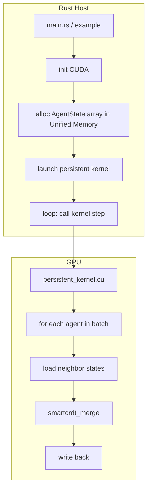

We’ll dive deep into **CudaClaw** – the GPU‑accelerated SmartCRDT orchestrator. Below is a comprehensive, annotated architecture of the current system, based on your repositories. Use this as a blueprint to understand what you have and what to simplify for the MVP.

---

# CudaClaw Architecture (Current State)

## 1. Overview
CudaClaw is a **Rust + CUDA** system that runs thousands of lightweight **cellular agents** on a GPU. Agents communicate via **CRDTs** (Conflict‑Free Replicated Data Types) for deterministic, lock‑free coordination. The system is designed for:

- **Massive scale:** 10,000+ concurrent agents.
- **Determinism:** No floating‑point ambiguity; exact geometric state.
- **Low latency:** <10ms per agent trigger.
- **GPU acceleration:** Persistent CUDA kernels with warp‑level parallelism.

The architecture is split into a **Rust host** (control plane, memory management, command dispatch) and **CUDA kernels** (agent execution, CRDT merges). A **memory bridge** ensures zero‑copy communication between CPU and GPU.

---

## 2. High‑Level Data Flow

```mermaid
flowchart TB
    subgraph Host [Rust Host]
        A[CLI / External API] --> B[Dispatcher]
        B --> C[Lock‑free Command Queue]
        C --> D[CUDA Bridge]
        D --> E[Unified Memory]
        E --> F[Persistent Kernel Launcher]
    end

    subgraph Device [GPU]
        F --> G[Persistent Kernel\n(executor.cu)]
        G --> H[Warp Groups]
        H --> I[Agent State Array\n(in Unified Memory)]
        I --> J[SmartCRDT Merge]
        J --> I
    end

    subgraph Monitoring
        K[Health Monitor] --> G
        L[Latency Benchmarks]
    end
```

**Flow description:**
1. **Host** receives commands (e.g., “add agent”, “trigger update”).
2. Commands are enqueued in a **lock‑free SPSC queue** (shared memory between host and device).
3. The **persistent kernel** on the GPU polls this queue and processes commands.
4. Agent states are stored in **Unified Memory** (accessible by both CPU and GPU).
5. Kernel groups threads into **warps** (32 threads) that cooperatively perform CRDT merges on agent batches.
6. Results are written back to Unified Memory; host can read them without explicit copy.
7. **Health monitor** checks kernel liveness and VRAM usage.

---

## 3. Component Breakdown (Current)

### 3.1 Rust Host (`src/`)
| File | Purpose | Annotations |
|------|---------|--------------|
| `cuda_claw.rs` | Main orchestrator: initializes CUDA, loads kernels, launches persistent kernel, manages agent array. | Core – keep minimal version. |
| `dispatcher.rs` | Receives commands from external sources (CLI, network) and pushes them to the lock‑free queue. | For MVP, we can bypass dispatcher and hardcode commands. |
| `bridge.rs` | Defines shared Rust/CUDA types with `#[repr(C)]` alignment. Also handles memory allocation (Unified Memory). | Essential – but can be simplified to a few structs. |
| `alignment.rs` | Compile‑time checks for memory layout compatibility. | Keep only the essential checks for agent struct. |
| `lock_free_queue.rs` | SPSC queue implementation for command passing. | Complex; consider replacing with a simpler pinned circular buffer for MVP. |
| `monitor.rs` | Health watchdog: checks kernel aliveness, VRAM usage, restarts if needed. | Omit for MVP; rely on manual restart. |

### 3.2 CUDA Kernels (`kernels/`)
| File | Purpose | Annotations |
|------|---------|--------------|
| `main.cu` | Entry points for kernel launches (e.g., `launch_persistent_kernel`). | Keep, but merge into a single kernel file. |
| `executor.cu` | Persistent worker kernel: runs an infinite loop, polls command queue, processes agents. | Core – simplify to a single loop without complex command handling. |
| `crdt_engine.cuh` | SmartCRDT engine (3,366 lines). Contains warp‑level merge logic. | Core – but must be slimmed down to essential merge operations. |
| `smartcrdt.cuh` | RGA CRDT implementation with Lamport timestamps. | Core – keep only the merge function. |
| `lock_free_queue.cuh` | Device‑side lock‑free queue functions. | Omit if we simplify command passing. |
| `shared_types.h` | Shared type definitions (mirrored in Rust). | Essential – keep minimal. |

### 3.3 Memory Bridge
- **Unified Memory** is used for zero‑copy access. All agent state resides in a single `AgentState` array allocated with `cudaMallocManaged`.
- **Alignment** is critical: Rust structs marked `#[repr(C)]` must match CUDA structs exactly. Current code includes extensive tests (`tests/alignment_test.rs`) to verify this.

### 3.4 Policies and Constraints
- `POLICY_VRAM.toml`, `POLICY_CPU.toml` define hard limits (e.g., 4GB VRAM, 8 CPU threads). These are aspirational; not enforced in code.

### 3.5 Testing and Benchmarks
- `tests/`: alignment, integration, latency.
- `examples/`: various demos (not listed but implied).

---

## 4. Key Algorithms

### 4.1 SmartCRDT
- **RGA (Replicated Growable Array)** CRDT with Lamport timestamps.
- Each agent maintains a sequence of operations; merges are conflict‑free.
- Merge complexity: O(log n) via warp‑level aggregation.

### 4.2 Warp‑Level Parallelism
- Warps (32 threads) collaborate using:
  - `__shfl_sync()` – exchange data.
  - `__ballot_sync()` – vote on conditions.
  - `__syncwarp()` – synchronize.
- Example: warp‑aggregated deduplication of updates.

### 4.3 Geometric State
Agents are defined by a 112‑bit state (14 bytes):
```c
struct AgentState {
    uint16_t position;   // 12 bits used
    float orientation;   // 32 bits
    float holonomy[9];   // 36 bits (3x3 matrix)
    float confidence;    // 32 bits
};
```
This compact representation enables massive scale.

---

## 5. Annotated Simplifications for MVP

To ship a minimal viable product, we must strip away everything that isn’t absolutely necessary to demonstrate the core idea: **GPU‑accelerated deterministic agents**.

### 5.1 Keep (Must‑Haves)
| Component | Minimal Form |
|-----------|--------------|
| `cuda_claw.rs` | Host code that allocates agent array, loads a single kernel, and steps the simulation. Remove dispatcher, monitoring. |
| `persistent_kernel.cu` | A single kernel that loops over agents, applies CRDT merges, and updates state. Hardcode neighbor relationships (e.g., simple grid). |
| `smartcrdt.cuh` | Only the merge function for agent state. Remove history tracking if not needed. |
| `shared_types.h` / `alignment.rs` | Define `AgentState` struct with `#[repr(C)]` and verify alignment with a simple test. |
| Example (`boids.rs`) | A runnable example that shows agents moving. |

### 5.2 Cut (Omit for MVP)
- **Dispatcher and lock‑free queue** – Instead, hardcode a simple command structure or just run a fixed simulation.
- **Health monitor** – Not needed for initial demos.
- **Multiple kernels** – Keep only `persistent_kernel.cu`.
- **Policy files** – Remove; they are documentation, not code.
- **Extensive tests** – Keep only alignment test and a basic integration test.
- **Web/ directory** – Not part of core engine.
- **Docs/ (research papers)** – Move to a separate repo.

### 5.3 Simplify
- **Command handling** – Replace lock‑free queue with a simple pinned buffer polled by kernel.
- **CRDT engine** – Strip down to the bare minimum: merge function that combines two agent states. Remove version vectors if not essential.
- **Warp primitives** – Use them only where absolutely needed; comment clearly.

---

## 6. Resulting MVP Architecture



The host simply:
1. Initializes CUDA.
2. Allocates a Unified Memory array of `AgentState`.
3. Launches the persistent kernel with one thread block per agent batch.
4. In a loop, calls `cudaDeviceSynchronize()` and optionally reads back data for visualization.

The kernel:
- Uses thread index to determine which agent to process.
- For each agent, it reads its own state and a few neighbors (from a pre‑computed neighbor list or via simple spatial hashing).
- Applies CRDT merge to update state.
- Writes back.

No command queue, no dispatcher, no monitoring – just a pure simulation that runs until interrupted.

---

## 7. Implementation Checklist for Team

### Week 1
- [ ] Create a new branch `mvp` in `cudaclaw` repo.
- [ ] Delete all files not in the “keep” list.
- [ ] Simplify `persistent_kernel.cu` to a single loop as described.
- [ ] Strip `smartcrdt.cuh` to essential merge.
- [ ] Rewrite `cuda_claw.rs` to minimal host.
- [ ] Write a simple example (e.g., `boids.rs`) that runs the simulation for 1000 steps and prints FPS.

### Week 2
- [ ] Test on a clean Ubuntu machine with CUDA 12+.
- [ ] Write `README.md` with quick start and theory link.
- [ ] Write `docs/theory.md` (1‑2 pages) explaining geometric CRDT insight.
- [ ] Record demo video.
- [ ] Publish to crates.io (optional) and announce.

---

## 8. Next Steps
Once CudaClaw MVP is stable, we’ll move to **ClawCanvas** (the visualizer). But first, focus on getting this core engine out the door.

Let me know if you need further details on any component, or if you’d like me to draft the stripped‑down `README.md` for CudaClaw.

We'll create a set of documents for your engineering team that clearly communicates the new direction, the MVP scope, and the path forward. These are designed to replace the existing heavy documentation and focus everyone on shipping.

---

## 1. README.md (New)

```markdown
# CudaClaw – GPU‑Native Agent Engine

[](https://crates.io/crates/cudaclaw)
[](https://docs.rs/cudaclaw)

**CudaClaw** is a GPU‑accelerated runtime for running **thousands of lightweight agents** with **deterministic coordination**. Agents use CRDTs and geometric constraints to communicate without locks – all on your GPU.

```rust
// Example: 10,000 agents doing simple flocking
use cudaclaw::prelude::*;

fn main() {
    let mut engine = Engine::new(10_000);          // allocates agents on GPU
    loop {
        engine.step();                              // one simulation step
        println!("fps: {}", engine.fps());
    }
}
```

## ✨ Key Features
- **Massive scale** – 10k+ agents on a single consumer GPU.
- **Deterministic** – exact geometric state, no floating‑point ambiguity.
- **CRDT coordination** – conflict‑free, lock‑free merges.
- **Warp‑parallel** – uses CUDA warps for efficient collaboration.
- **Minimal host interaction** – agents run persistently on the GPU.

## 🚀 Quick Start

### Prerequisites
- Rust 1.70+
- CUDA Toolkit 12+ (with `nvcc` in PATH)
- A CUDA‑capable GPU (compute capability 6.0+)

### Add to your project
```toml
[dependencies]
cudaclaw = "0.1"
```

### Run the example
```bash
git clone https://github.com/SuperInstance/cudaclaw
cd cudaclaw
cargo run --example boids --release
```

You should see FPS printed – that’s your agents running on the GPU.

## 📖 Learn More
- [Architecture Overview](docs/ARCHITECTURE.md)
- [How Geometric CRDTs Work](docs/THEORY.md) (short visual explainer)
- [Roadmap](docs/ROADMAP.md)

## 🤝 Contributing
We welcome contributions! See [CONTRIBUTING.md](CONTRIBUTING.md) for guidelines.

## License
MIT © SuperInstance
```

---

## 2. TRANSITION_GUIDE.md

```markdown
# Transition Guide: From Research Prototype to MVP

This document explains the changes we’re making to CudaClaw to ship a minimal, focused MVP. It’s meant for the engineering team to understand what we’re cutting, why, and what the final MVP looks like.

## Why an MVP?
We’ve built powerful technology but buried it under complexity. Competitors like Paperclip are shipping simpler products faster. Our goal is to **demonstrate our unique value** – deterministic GPU agents – with the smallest possible working system.

## What We’re Keeping (Must‑Haves)
- **Persistent kernel** that runs indefinitely on the GPU.
- **SmartCRDT merge** for agent state (only the core merge function).
- **Agent state array** in Unified Memory.
- **One example** (boids) that shows agents moving.
- **Minimal host code** to launch the kernel and step the simulation.

## What We’re Cutting (Omitted for MVP)
| Component | Why Cut |
|-----------|---------|
| Command dispatcher & lock‑free queue | Not needed for a fixed simulation; we can hardcode behavior. |
| Health monitor | Overkill; we’ll manually restart if needed. |
| Multiple kernels | We only need one persistent kernel. |
| Policy files (VRAM, CPU) | They were aspirational, not enforced. |
| Extensive tests (latency, integration) | Keep only alignment test and a basic smoke test. |
| Web dashboard | Not part of core engine. |
| Research papers (docs/) | Move to a separate repo; not needed for users. |
| SOUL.md, onboarding protocols | Distracting; remove. |

## What We’re Simplifying
- **CRDT engine**: strip to just the merge function; remove version vectors if not essential.
- **Warp primitives**: use only where necessary, with clear comments.
- **Memory alignment**: keep only the essential `#[repr(C)]` checks.

## Resulting MVP Architecture
See [ARCHITECTURE.md](docs/ARCHITECTURE.md) for a diagram.

## Next Steps for the Team
1. Create an `mvp` branch.
2. Delete all files not in the keep list.
3. Simplify `persistent_kernel.cu` to a single loop (see checklist in ARCHITECTURE.md).
4. Update `cuda_claw.rs` to minimal host.
5. Ensure the `boids` example runs and prints FPS.
6. Write new README and documentation.
7. Test on a clean machine and publish.

## After MVP
We’ll gather feedback and then build the visualizer (ClawCanvas) and later AutoClaw. The roadmap is in [ROADMAP.md](docs/ROADMAP.md).
```

---

## 3. ARCHITECTURE.md (Simplified)

```markdown
# CudaClaw Architecture (MVP)


## Key Components

### Host (Rust)
- **Engine** – created with `Engine::new(num_agents)`. Allocates Unified Memory and launches kernel.
- **step()** – triggers one simulation frame on the GPU (calls `cudaDeviceSynchronize` after kernel launch).

### Device (CUDA)
- **persistent_kernel.cu** – runs until stopped. Each thread processes one agent.
- **smartcrdt_merge** – function that merges two agent states deterministically.

### Agent State
```rust
#[repr(C)]
struct AgentState {
    pos_x: u16,        // 12 bits used (encoded as dodecet)
    pos_y: u16,
    pos_z: u16,
    vel_x: i16,         // velocity components
    vel_y: i16,
    vel_z: i16,
    // ... other fields as needed (total ≤ 112 bits)
}
```

## Memory Model
- Unified Memory (`cudaMallocManaged`) so CPU and GPU share the same data.
- No explicit copies – the kernel reads/writes directly.

## Warp Coordination
- Warps (32 threads) can collaborate using shuffle instructions. Example: finding nearest neighbor across the warp.
- See `kernels/warp_helpers.cuh` for utilities.

## Example: Boids
The `boids` example implements simple flocking rules as geometric constraints. It demonstrates:
- 10,000 agents
- Each agent reads its own state and a few neighbors
- CRDT merge ensures deterministic updates
- FPS printed to console

```

---

## 4. ROADMAP.md

```markdown
# CudaClaw Roadmap

## Phase 1: MVP (April 2026)
- [x] Minimal kernel with persistent loop
- [x] SmartCRDT merge for agent state
- [x] Single example (boids)
- [x] Simplified host API
- [x] Documentation: README, ARCHITECTURE, THEORY
- [x] Publish to crates.io

**Goal:** Developers can run 10k agents on their GPU and see deterministic behavior.

## Phase 2: Visualization (May 2026)
- Build **ClawCanvas** – a React app that connects to CudaClaw via WebSocket.
- Render agent positions in real time.
- Provide a live demo on the website.

**Goal:** Make the engine tangible and demo‑worthy.

## Phase 3: Production Hardening (Q3 2026)
- Add robust error handling and recovery.
- Support dynamic agent addition/removal.
- Optimize memory bandwidth (e.g., compressed state).
- Benchmark on multiple GPU architectures.
- Write integration guide for other languages (Python, etc.).

**Goal:** Ready for integration into larger systems.

## Phase 4: Ecosystem (Q4 2026)
- Release **AutoClaw** as a high‑level agent framework built on CudaClaw.
- Partner with research labs and game studios.
- Explore WebGPU backend for browser‑based agents.

**Goal:** Establish CudaClaw as the standard for deterministic agent swarms.

## How You Can Help
- **Try the MVP** and report bugs.
- **Contribute examples** (flocking, pathfinding, swarm intelligence).
- **Write bindings** for your favorite language.
- **Spread the word** – a demo video or blog post helps enormously.
```

---

## 5. THEORY.md (Short Visual Explainer)

```markdown
# Geometric CRDTs: A Short Explainer

**Traditional agents** use locks or consensus algorithms – slow and probabilistic.

**CudaClaw agents** are points in a geometric space. Their state is a **CRDT** (Conflict‑Free Replicated Data Type), which means any two agents can merge their states without locks, and the result is always the same.

## The Insight
CRDTs and geometric constraints are mathematically equivalent. A position in space is just a CRDT that converges to the “correct” value when constraints are applied.

## Example: Boids
In flocking, each bird tries to:
- Cohere (move toward center of neighbors)
- Align (match velocity)
- Separate (avoid collisions)

These are geometric constraints. CudaClaw encodes them as CRDT merge operations: each bird’s state is merged with its neighbors’ states using a deterministic rule. Because the merge is a CRDT, the whole flock converges deterministically – no randomness, no locks.

## Why GPUs?
- Warps let us merge 32 agents at once.
- Unified memory avoids copying.
- Persistent kernels eliminate launch overhead.

## Learn More
- [Original paper (PDF)](link-to-paper)
- [CRDTs explained](https://crdt.tech/)
```

---

## 6. CONTRIBUTING.md

```markdown
# Contributing to CudaClaw

We’re excited you want to help! Here’s how you can contribute.

## Code of Conduct
Please be respectful and constructive. See [CODE_OF_CONDUCT.md](CODE_OF_CONDUCT.md).

## Getting Started
1. Fork the repo.
2. Clone your fork.
3. Build with `cargo build --release`.
4. Run examples: `cargo run --example boids --release`.

## Development Workflow
- Use the `mvp` branch for all changes (until we have a stable release).
- Keep changes focused. If you’re adding a new feature, discuss it in an issue first.
- Write tests for critical functionality.
- Run `cargo fmt` and `cargo clippy` before committing.

## What We Need Help With
- **Examples**: More simulations (ants, traffic, swarms).
- **Performance**: Optimize warp utilization, reduce memory bandwidth.
- **Documentation**: Improve explanations, add diagrams.
- **Bindings**: Python, C, etc.

## Pull Request Process
1. Update the README or docs if your change affects usage.
2. Ensure all tests pass.
3. Request review from @SuperInstance.

## License
By contributing, you agree that your work will be licensed under the MIT License.
```

---

These documents give your team a clear picture of the transition and the new focus. The next step is to start cutting code and building the MVP. Let me know if you need any adjustments or further details.